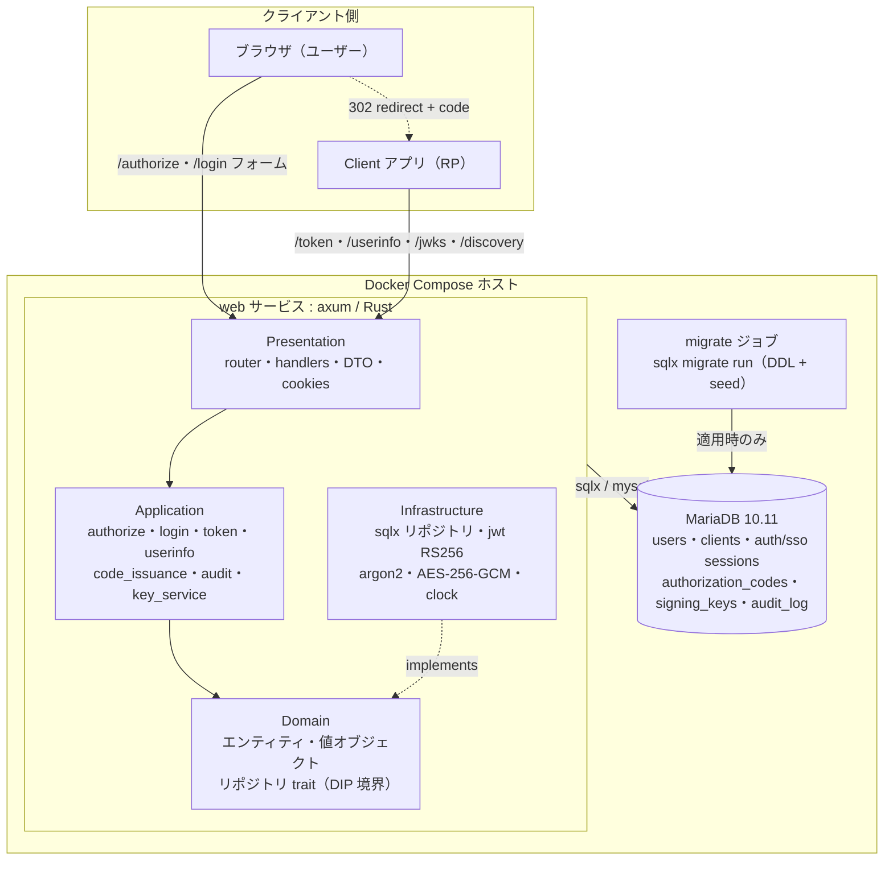
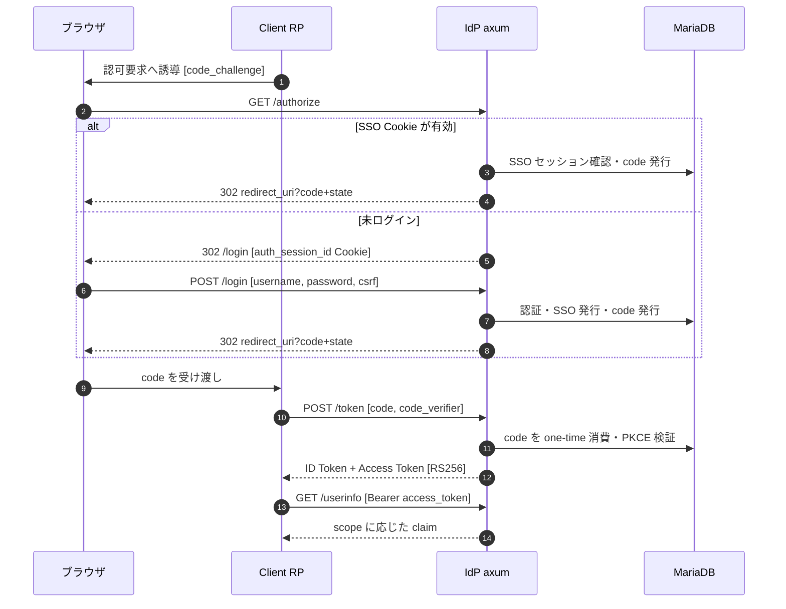

# IDPMVP

Rust 製の OpenID Connect Identity Provider（IdP）の MVP。
**OpenID Connect Core 1.0** に準拠し、OAuth 2.1 draft / RFC 9700 の推奨事項を取り込んでいる。
IdP ドメインの Cookie セッションによる **SSO** を含む。

## 概要

| 項目 | 内容 |
|---|---|
| 対応フロー | Authorization Code Flow のみ（Implicit / ROPC 非対応） |
| PKCE | 必須（public / confidential とも）。`code_challenge_method` は `S256` のみ |
| 対応 scope | `openid`（必須）、拡張として `profile` / `email` |
| トークン | ID Token / Access Token とも JWT（RS256 署名、`kid` で鍵識別） |
| Refresh Token | MVP 対象外 |
| SSO | IdP ドメインの Cookie セッション（idle 8h / absolute 24h） |
| スタック | Rust（axum / tokio / sqlx）+ MariaDB 10.11 |

## システム構成

同一ホストの Docker Compose 上で `web`（IdP 本体）と `mariadb` が動作し、DDL・マスタデータの適用は
常駐させない `migrate` ワンショットジョブが担う。`web` は内部で DDD 4層に分かれる。



### 認可コードフロー（PKCE S256 + SSO）



## 機能一覧

### OIDC コア

- **認可エンドポイント** `GET /authorize` — 認可リクエスト検証（client・redirect_uri 完全一致・
  scope・state/nonce 必須・PKCE S256）。有効な SSO セッションがあれば再ログインなしで
  authorization code を発行し、なければログイン画面へ誘導する
- **トークンエンドポイント** `POST /token` — クライアント認証（confidential は
  `client_secret_basic`、public は認証なし）、authorization code の**原子的 one-time 消費**
  （再利用は `invalid_grant` として検知）、PKCE 検証、ID Token / Access Token の発行
- **UserInfo** `GET /userinfo` — Bearer の Access Token（`typ=at+jwt`）を検証し、
  scope に応じたクレームのみ返却（`openid`→`sub` / `email`→`email`, `email_verified` /
  `profile`→`preferred_username`, `name`）
- **Discovery** `GET /.well-known/openid-configuration` — issuer・各エンドポイント・対応機能の公開
- **JWKS** `GET /.well-known/jwks.json` — 署名検証用の公開鍵（ACTIVE + RETIRED）の公開

### 認証・セッション

- **ユーザー登録** `POST /auth/register` — argon2 によるパスワードハッシュ保存
- **ログイン画面** `GET /login` / **ログイン** `POST /login` — サーバレンダリングのフォーム
  （`Accept-Language` により英語/日本語を切替、fluent による i18n）、CSRF トークン検証
- **SSO セッション** — ログイン成功時に発行。Cookie には平文 session_id、DB には SHA-256 ハッシュのみ保存。
  2 回目以降の `/authorize` では再ログインなしで code を発行し、idle 期限を延長する
  （`auth_time` は初回ログイン時刻を維持）
- **アカウントロック** — username 単位で連続 10 回失敗 → 15 分ロック（成功時リセット）。
  IP 単位のレート制限も実施
- **Cookie 属性** — `HttpOnly` / `Secure`（設定可）/ `SameSite=Lax` / `Path=/`

### セキュリティ・鍵管理

- authorization code（有効 60 秒）・SSO session_id は平文を DB に置かず SHA-256 ハッシュのみ保存
- RSA-2048 署名鍵は起動時に自動ブートストラップ。秘密鍵は AES-256-GCM で暗号化保存
  （暗号化キーは DB 外＝環境変数で管理）
- `state` は認可レスポンスで透過返却、`nonce` は ID Token に反映

### 運用・可観測性

- **監査ログ** — ログイン成否・ロック、code 発行/使用/再利用検知、トークン発行、
  クライアント認証失敗、SSO セッション作成/復元/期限切れを、構造化ログ（JSON）と
  `audit_log` テーブルへ二重出力。`correlation_id`（`x-request-id`）でリクエストと一気通貫で追跡可能
- **ヘルスチェック** — `GET /healthz`（liveness）/ `GET /readyz`（readiness）
- **スキーマ整合の fail-fast** — 起動時に sqlx マイグレーション version と DB を突合し、
  DB が期待未満なら起動を失敗させる
- **OpenAPI 自動生成** — API 仕様は utoipa から自動生成（手書きしない）。
  起動後 `GET /api/openapi.json`、Swagger UI は `GET /api/docs`

## ドキュメント

| ドキュメント | 内容 |
|---|---|
| [`docs/OIDC_INPUT.md`](docs/OIDC_INPUT.md) | 設計仕様（データモデル・API・トークン仕様・監査ログ） |
| [`docs/ARCHITECTURE.md`](docs/ARCHITECTURE.md) | レイヤー構成（DDD 4層）・実装パターン・命名規則 |
| [`docs/OPERATIONS.md`](docs/OPERATIONS.md) | 手順書（起動・マイグレーション・テスト・環境変数・クライアント登録） |
| [`docs/Progress.md`](docs/Progress.md) | 進行中・未着手タスク |
| [`docs/CHANGELOG.md`](docs/CHANGELOG.md) | 完了した変更の要約 |
| [`docs/adr/`](docs/adr/) | 設計判断（ADR） |

## クイックスタート

### コンテナ一括（推奨）

`scripts/init.sh` が秘密情報の生成（`.env`）・DB 起動・マイグレーション適用・`web` の起動までを冪等に行う。

```sh
./scripts/init.sh              # db + web を初期化（既存 .env は上書きしない）
```

初期管理ユーザー `admin@example.com`（既定パスワードは初回ログイン後に変更）が seed される。
デプロイは `./scripts/deploy.sh`。

### ローカル開発（web はホストで実行）

```sh
docker compose up -d mariadb   # MariaDB 10.11 を起動
sqlx migrate run               # マイグレーション適用（要 DATABASE_URL）
cargo run                      # IdP サーバ起動（既定: 0.0.0.0:8080）
```

詳細な手順・環境変数は [`docs/OPERATIONS.md`](docs/OPERATIONS.md) を参照。

## MVP 対象外（将来拡張）

Refresh Token / MFA / Consent 画面 / Dynamic Client Registration / Revocation・Introspection /
Logout（Front-channel・Back-channel）/ JAR・PAR・DPoP・mTLS / 管理コンソール。
詳細は設計仕様 §8・§9 を参照。
