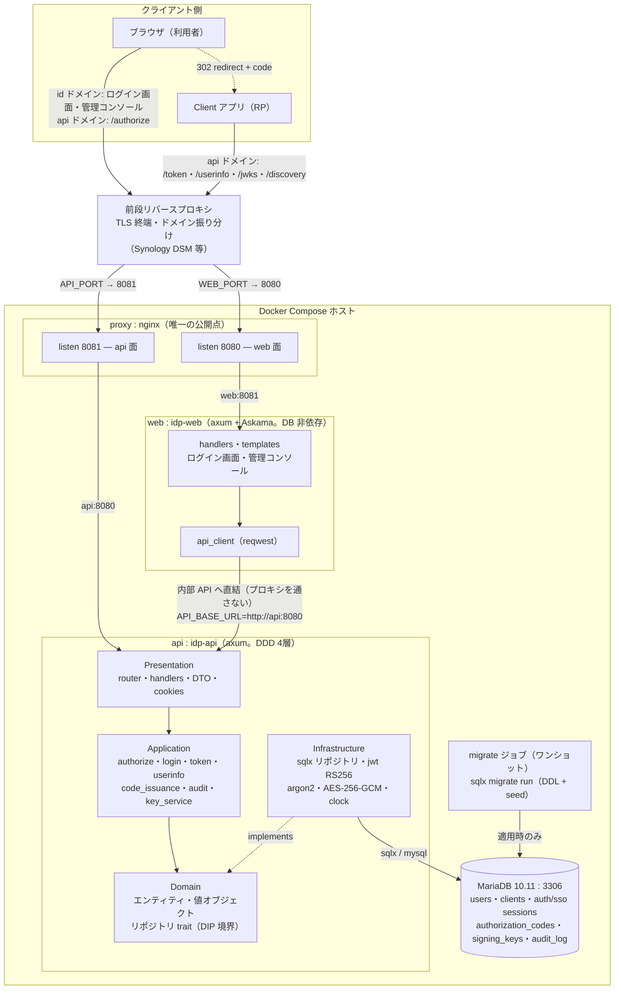
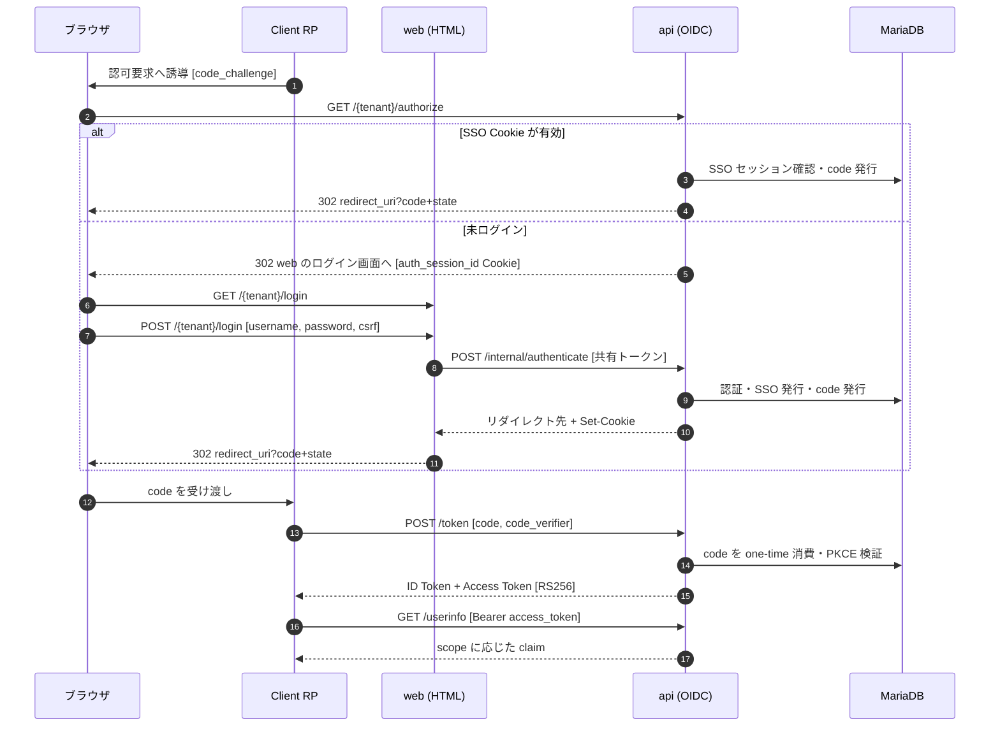

# IDP

Rust 製の OpenID Connect Identity Provider（IdP）。
**OpenID Connect Core 1.0** に準拠し、OAuth 2.1 draft / RFC 9700 の推奨事項を取り込んでいる。
IdP ドメインの Cookie セッションによる **SSO** を含む。

## 概要

| 項目 | 内容 |
|---|---|
| 対応フロー | Authorization Code Flow のみ（Implicit / ROPC 非対応） |
| PKCE | 必須（public / confidential とも）。`code_challenge_method` は `S256` のみ |
| 対応 scope | `openid`（必須）、拡張として `profile` / `email` |
| トークン | ID Token / Access Token とも JWT（RS256 署名、`kid` で鍵識別） |
| Refresh Token | 対応 |
| SSO | IdP ドメインの Cookie セッション（idle 8h / absolute 24h） |
| スタック | Rust（axum / tokio / sqlx）+ MariaDB 10.11 |

## システム構成

同一ホストの Docker Compose 上で 4 つのサービスが動く（ADR-0007）。

- **api**（`idp-api`）— OIDC protocol・JSON 管理 API・内部 API。**DB へ直結する唯一のサービス**で、
  内部は DDD 4層に分かれる
- **web**（`idp-web`）— ログイン画面・管理コンソールの HTML 描画。**sqlx を持たず**、データ操作は
  api へ HTTP 越しに行う
- **proxy**（nginx）— **唯一の公開点**。api・web コンテナはホストへ publish しない
- **mariadb** — 永続化。DDL・マスタデータの適用は常駐させない `migrate` ワンショットジョブが担う

公開の形（`PUBLISH_TOPOLOGY`）の既定は **`domain-split`**（ADR-0015・ADR-0016）。同梱プロキシが
**リッスンポートでサービスを分け**、前段のリバースプロキシが TLS 終端とドメイン振り分けを行う。
1 ポートをパスで振り分ける単一オリジン構成（`single-origin`）も明示指定で選べる。


```mermaid
graph TB
  subgraph client["クライアント側"]
    B["ブラウザ（利用者）"]
    RP["Client アプリ（RP）"]
  end

  FE["前段リバースプロキシ<br/>TLS 終端・ドメイン振り分け<br/>（Synology DSM 等）"]

  subgraph host["Docker Compose ホスト"]
    subgraph proxy["proxy : nginx（唯一の公開点）"]
      direction TB
      PW["listen 8080 — web 面"]
      PA["listen 8081 — api 面"]
    end

    subgraph web["web : idp-web（axum + Askama。DB 非依存）"]
      direction TB
      WH["handlers・templates<br/>ログイン画面・管理コンソール"]
      WC["api_client（reqwest）"]
      WH --> WC
    end

    subgraph api["api : idp-api（axum。DDD 4層）"]
      direction TB
      P["Presentation<br/>router・handlers・DTO・cookies"]
      A["Application<br/>authorize・login・token・userinfo<br/>code_issuance・audit・key_service"]
      D["Domain<br/>エンティティ・値オブジェクト<br/>リポジトリ trait（DIP 境界）"]
      I["Infrastructure<br/>sqlx リポジトリ・jwt RS256<br/>argon2・AES-256-GCM・clock"]
      P --> A
      A --> D
      I -. implements .-> D
    end

    DB[("MariaDB 10.11 : 3306<br/>users・clients・auth/sso sessions<br/>authorization_codes・signing_keys・audit_log")]
    MIG["migrate ジョブ（ワンショット）<br/>sqlx migrate run（DDL + seed）"]

    PW -->|"web:8081"| WH
    PA -->|"api:8080"| P
    WC -->|"内部 API へ直結（プロキシを通さない）<br/>API_BASE_URL=http://api:8080"| P
    I -->|"sqlx / mysql"| DB
    MIG -->|"適用時のみ"| DB
  end

  B -->|"id ドメイン: ログイン画面・管理コンソール<br/>api ドメイン: /authorize"| FE
  RP -->|"api ドメイン: /token・/userinfo・/jwks・/discovery"| FE
  FE -->|"WEB_PORT → 8080"| PW
  FE -->|"API_PORT → 8081"| PA
  B -.->|"302 redirect + code"| RP
```

`idp-contracts` クレートが api ↔ web で共有する DTO・Cookie 名・CSRF 導出・ランタイム設定を単一定義する
（`web` は sqlx / infrastructure に依存しない。crate 境界で強制）。

### スケール前提: **api は単一インスタンスで動かす**（G9）

api は同時に 1 プロセスだけ動かすことを前提に作られている。`docker-compose` の `api` サービスを
`--scale` で増やしたり、複数ホストへ並べたりしないこと。前提が崩れると次が壊れる:

| 仕組み | 実装 | 2 プロセス以上にすると |
|---|---|---|
| ログインのレート制限 | `InMemoryLoginRateLimiter`（プロセス内メモリ） | 上限が実質インスタンス数倍に緩む |
| テナント解決・権限・CORS のキャッシュ | `InMemoryTtlCache`（プロセス内メモリ） | 更新時の invalidation が他インスタンスへ伝わらず、TTL の間だけ古い判定が残る |
| 署名鍵の自動ローテーション | 排他制御なしのバックグラウンドループ | 同時に走って鍵が二重生成されうる |
| 期限切れレコードの GC | 同上（冪等な DELETE） | 競合はするが害は無い（同じ行を消すだけ） |

アカウントロック（`users.failed_login_count`）と authorization code / refresh token の単回使用は
**DB 側で原子的**に判定しているため、インスタンス数の影響を受けない。

水平スケールが必要になったら、共有ストア（Redis）実装への差し替えと、鍵ローテーションの
DB アドバイザリロックが前提になる。`Cache` / `LoginRateLimiter` はいずれもトレイト（DIP 境界）に
なっているので、差し替え先は infrastructure 層に閉じる。

web は状態をプロセス内に持たない（データ操作はすべて api へ HTTP 越し）ため、複数インスタンスにできる。

### 待ち受けポート

ポートは **前段プロキシ → ホスト公開ポート（`.env` で変える）→ コンテナ内ポート（固定）** の 3 段。

| 段 | 待ち受け | 既定値 | 転送先 |
|---|---|---|---|
| ホスト公開（web） | `WEB_BIND_HOST`:`WEB_PORT` | `127.0.0.1:8060` | `proxy:8080` |
| ホスト公開（api） | `API_BIND_HOST`:`API_PORT` | `127.0.0.1:8070` | `proxy:8081` |
| コンテナ内 | `proxy` | `8080`（web 面）/ `8081`（api 面） | `web:8081` / `api:8080` |
| コンテナ内 | `api`（`BIND_ADDR`） | `0.0.0.0:8080` | MariaDB |
| コンテナ内 | `web`（`WEB_BIND_ADDR`） | `0.0.0.0:8081` | `http://api:8080` |
| コンテナ内 | `mariadb` | `3306` | — |

- **proxy の `8080` は web 面**（api コンテナの `8080` とは別物）。単一オリジン構成とポート公開定義を
  共有するための割り当て（ADR-0015）。
- ホスト公開の bind 既定は**ループバック**。`single-origin` では `API_PORT` を公開しない。
- `/internal/*` はプロキシが**どの公開ポートでも 404** を返す（多層防御）。web→api の内部呼び出しは
  Compose ネットワーク内で直結し、共有シークレット `INTERNAL_SERVICE_TOKEN` で保護する。

詳細（stg/prod 併置時のポート分け・ローカル開発時の待ち受け）は
[`docs/OPERATIONS.md`](docs/OPERATIONS.md)「待ち受けポート一覧」を参照。

### 認可コードフロー（PKCE S256 + SSO）

`/authorize`・`/token`・`/userinfo` は **api**、ログイン画面は **web** が担う。web は認証処理そのものを
持たず、api の内部 API（`/internal/authenticate*`）へ委譲する。


```mermaid
sequenceDiagram
  autonumber
  participant U as ブラウザ
  participant C as Client RP
  participant W as web (HTML)
  participant API as api (OIDC)
  participant DB as MariaDB

  C->>U: 認可要求へ誘導 [code_challenge]
  U->>API: GET /{tenant}/authorize
  alt SSO Cookie が有効
    API->>DB: SSO セッション確認・code 発行
    API-->>U: 302 redirect_uri?code+state
  else 未ログイン
    API-->>U: 302 web のログイン画面へ [auth_session_id Cookie]
    U->>W: GET /{tenant}/login
    U->>W: POST /{tenant}/login [username, password, csrf]
    W->>API: POST /internal/authenticate [共有トークン]
    API->>DB: 認証・SSO 発行・code 発行
    API-->>W: リダイレクト先 + Set-Cookie
    W-->>U: 302 redirect_uri?code+state
  end
  U->>C: code を受け渡し
  C->>API: POST /token [code, code_verifier]
  API->>DB: code を one-time 消費・PKCE 検証
  API-->>C: ID Token + Access Token [RS256]
  C->>API: GET /userinfo [Bearer access_token]
  API-->>C: scope に応じた claim
```

## 機能一覧

### OIDC コア

- **認可エンドポイント** `GET /authorize` — 認可リクエスト検証（client・redirect_uri 完全一致・
  scope・state/nonce 必須・PKCE S256）。有効な SSO セッションがあれば再ログインなしで
  authorization code を発行し、なければログイン画面へ誘導する
- **トークンエンドポイント** `POST /token` — クライアント認証（confidential は登録した方式＝
  `client_secret_basic` / `client_secret_post` / `private_key_jwt`、public は認証なし）、
  authorization code の**原子的 one-time 消費**
  （再利用は `invalid_grant` として検知）、PKCE 検証、ID Token / Access Token の発行
- **機械（人ではない呼び出し元）の認証** — CI・バッチ・サーバ間連携は `client_credentials` grant で
  トークンを取る。資格情報には `private_key_jwt`（RFC 7523）を選べ、共有シークレットを持たずに
  署名済み assertion だけで認証する。assertion は `jti` で 1 回きり（ADR-0030）
- **UserInfo** `GET /userinfo` — Bearer の Access Token（`typ=at+jwt`）を検証し、
  scope に応じたクレームのみ返却（`openid`→`sub` / `email`→`email`, `email_verified` /
  `profile`→`preferred_username`, `name`）
- **Discovery** `GET /.well-known/openid-configuration` — issuer・各エンドポイント・対応機能の公開
- **JWKS** `GET /.well-known/jwks.json` — 署名検証用の公開鍵（ACTIVE + RETIRED）の公開

### 認証・セッション

- **ユーザー登録** `POST /auth/register` — argon2 によるパスワードハッシュ保存
- **ログイン画面** `GET /login` / **ログイン** `POST /login` — サーバレンダリングのフォーム
  （`Accept-Language` により英語/日本語を切替、fluent による i18n）、CSRF トークン検証
- **SSO セッション** — ログイン成功時に発行。Cookie には平文 session_id、DB には SHA-256 ハッシュのみ保存。
  2 回目以降の `/authorize` では再ログインなしで code を発行し、idle 期限を延長する
  （`auth_time` は初回ログイン時刻を維持）
- **アカウントロック** — username 単位で連続 10 回失敗 → 15 分ロック（成功時リセット。閾値は
  `LOGIN_MAX_FAILED_ATTEMPTS` / `LOGIN_LOCK_DURATION_SECS` で変更可）。パスワードと TOTP（MFA）の
  失敗は同じカウンタを進める。IP 単位のレート制限も両者で同じ枠を消費する
- **Cookie 属性** — `HttpOnly` / `Secure`（設定可）/ `SameSite=Lax` / `Path=/`

### セキュリティ・鍵管理

- authorization code（有効 60 秒）・SSO session_id は平文を DB に置かず SHA-256 ハッシュのみ保存
- RSA-2048 署名鍵は起動時に自動ブートストラップ。秘密鍵は AES-256-GCM で暗号化保存
  （暗号化キーは DB 外＝環境変数で管理）
- `state` は認可レスポンスで透過返却、`nonce` は ID Token に反映

### 運用・可観測性

- **監査ログ** — ログイン成否・ロック、code 発行/使用/再利用検知、トークン発行、
  クライアント認証失敗、SSO セッション作成/復元/期限切れを、構造化ログ（JSON）と
  `audit_log` テーブルへ二重出力。`correlation_id`（`x-request-id`）でリクエストと一気通貫で追跡可能
- **ヘルスチェック** — `GET /healthz`（liveness）/ `GET /readyz`（readiness）
- **スキーマ整合の fail-fast** — 起動時に sqlx マイグレーション version と DB を突合し、
  DB が期待未満なら起動を失敗させる
- **OpenAPI 自動生成** — API 仕様は utoipa から自動生成（手書きしない）。
  起動後 `GET /api/openapi.json`、Swagger UI は `GET /api/docs`

## ドキュメント

| ドキュメント | 内容 |
|---|---|
| [`docs/OIDC_INPUT.md`](docs/OIDC_INPUT.md) | 設計仕様（データモデル・API・トークン仕様・監査ログ） |
| [`docs/ARCHITECTURE.md`](docs/ARCHITECTURE.md) | レイヤー構成（DDD 4層）・実装パターン・命名規則 |
| [`docs/OPERATIONS.md`](docs/OPERATIONS.md) | 手順書（起動・マイグレーション・テスト・環境変数・クライアント登録） |
| [`docs/Progress.md`](docs/Progress.md) | 進行中・未着手タスク |
| [`docs/CHANGELOG.md`](docs/CHANGELOG.md) | 完了した変更の要約 |
| [`docs/adr/`](docs/adr/) | 設計判断（ADR） |

## クイックスタート

### コンテナ一括（推奨）

`scripts/build.sh` がイメージと配布用バンドル（`dist/`）を作り、`scripts/deploy.sh` が
秘密情報の生成（`.env`）・DB 起動・マイグレーション適用・起動までを冪等に行う。stg/prod を同一ホストに置く場合は `.env.staging.example` / `.env.production.example` で外部公開ポートとイメージタグを分ける。

```sh
./scripts/build.sh             # イメージビルド → dist/ にデプロイバンドルを出力
./scripts/deploy.sh app        # 初回も更新も app モードで実行（既存 .env は上書きしない）
```

初期管理ユーザー `admin@example.com`（既定パスワードは初回ログイン後に変更）が seed される。
`.env` で環境に合わせて確認するのは公開 URL（`ISSUER`＝api / `PUBLIC_WEB_BASE_URL`＝web）と
公開ポート（`WEB_PORT` / `API_PORT`）。`ISSUER` は配置後に root 管理者の設定画面からも変更できる
（ADR-0017。同じ画面の再起動ボタンで反映する）。
別ホストへのデプロイは `dist/` を転送して中の `./deploy.sh` を実行する（`scripts/README.md` 参照）。

### ローカル開発（api・web をホストで実行）

```sh
docker compose up -d mariadb   # MariaDB 10.11 を起動
sqlx migrate run               # マイグレーション適用（要 DATABASE_URL）
# 別々のシェルで起動する（web は api を API_BASE_URL 越しに呼ぶ）
PUBLIC_WEB_BASE_URL=http://localhost:8081 cargo run -p idp-api   # api 起動（既定: 0.0.0.0:8080）
PUBLIC_WEB_BASE_URL=http://localhost:8081 API_BASE_URL=http://localhost:8080 \
  cargo run -p idp-web                                           # web 起動（既定: 0.0.0.0:8081）
```

プロキシを立てないため、ログイン画面・管理コンソールは web（`:8081`）、OIDC protocol・JSON 管理 API は
api（`:8080`）へ直接アクセスする。`PUBLIC_WEB_BASE_URL` は**両プロセスに同値で**渡すこと（未設定だと
`ISSUER`＝api の `:8080` にフォールバックし、`/authorize` がログイン画面へ飛ばす先を api 側にしてしまう）。
両者は同一の `INTERNAL_SERVICE_TOKEN` も共有する。

詳細な手順・環境変数は [`docs/OPERATIONS.md`](docs/OPERATIONS.md) を参照。

